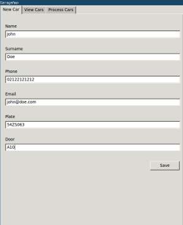

#plate-track
------------
Ultimate goal is constructing a software for autonomous garage door 
which would use alive camera to recognize entering car and ardunio to
open the door.

Currently, offline plate recording is done. 

<br>
**_sqlite3_** used to create database
<br>
**_pyqt_** used to introduce user interface
<br>
**_openalpr_** is used to recognize car plates

OpenAlpr's python inteface was extremely slow in my PC, for this reason
I used system call approach and parsed stdout in *plate_reader.py* as following:

```
cmd = 'alpr -c eu picture.png'
proc = subprocess.Popen([cmd], stdout=subprocess.PIPE, shell=True)
```

##Dependencies

```
wget -O - http://deb.openalpr.com/openalpr.gpg.key | sudo apt-key add -
echo "deb http://deb.openalpr.com/master/ openalpr main" | sudo tee /etc/apt/sources.list.d/openalpr.list
sudo apt-get update
sudo apt-get install openalpr openalpr-daemon openalpr-utils libopenalpr-dev
sudo apt-get install python-qt4
```

##Usage

```
python initializer.py
python ui.py
```
##Beneficial

```
sudo apt-get install sqliteman
```

##Screenshots





